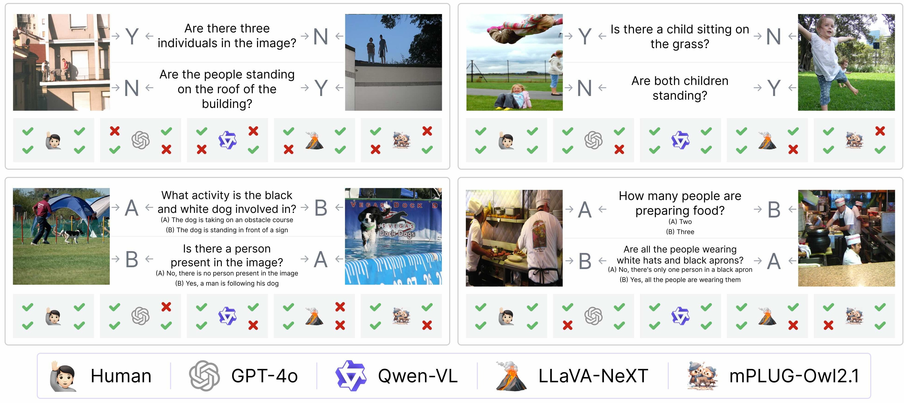

# NaturalBench: Evaluating Vision-Language Models on Natural Adversarial Samples

 

 Baiqi Li, Zhiqiu Lin, Wenxuan Peng, Jean de Dieu Nyandwi, Daniel Jiang, Zixian Ma, Simran Khanuja, Ranjay Krishna, Graham Neubig, Deva Ramanan
 

    

## Release Updates

* Evaluation code and benchmark coming soon!

<!-- ## Contents

* Installation
* Getting started
* Evaluation
* Leaderboard

## Installation

## Getting Started

## Evaluation

## Leaderboard -->

